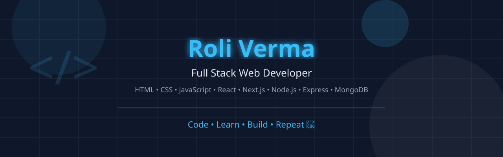

<div align="center">



</div>

<br>
<div align="center">

# Hi 👋, I'm Roli Verma

### 💻 Full Stack Web Developer | B.Tech CSE Student | React & Next.js Developer


<br>


</div>

---

# 👨‍💻 About Me

```yaml
Name: Roli Verma

Education:
  B.Tech CSE (AKTU)

Role:
  Full Stack Web Developer

Location:
  India 🇮🇳

Frontend:
  - HTML5
  - CSS3
  - JavaScript
  - React.js
  - Next.js
  - Tailwind CSS
  - Bootstrap

Backend:
  - Node.js
  - Express.js

Database:
  - MySQL
  - MongoDB

Programming Languages:
  - C
  - C++
  - JavaScript

Currently Learning:
  - Advanced React
  - Next.js
  - REST APIs
  - MongoDB
  - Backend Development
  - Data Structures & Algorithms

Goal:
  Become a Software Engineer at a Product-Based Company 🚀

Fun Fact:
  I enjoy turning ideas into responsive and modern web applications.
```

---

# 🚀 What I'm Doing

- 🌱 Learning **React.js**, **Next.js**, **Node.js**, and **Express.js**
- 💻 Building responsive full-stack web applications
- 📚 Strengthening DSA and problem-solving skills
- 🚀 Creating projects to improve my portfolio
- 🎯 Preparing for internships and software engineering roles

---

# 💻 Tech Stack

## 🚀 Languages

<p align="center">


</p>

---

## 🎨 Frontend Development

<p align="center">


</p>

---

## ⚙️ Backend Development

<p align="center">


</p>

---

## 🗄️ Database

<p align="center">


</p>

---

## 🛠️ Tools & Platforms

<p align="center">


</p>

---

# 🚀 Featured Projects

<table>

<tr>

<td width="50%">

## 🌐 Personal Portfolio

A modern and fully responsive personal portfolio website showcasing my skills, projects and contact information.

### Tech Stack


<br><br>

<a href="https://github.com/roliverma9161">

</a>

</td>

<td>


</td>

</tr>

</table>

---

<table>

<tr>

<td>


</td>

<td width="50%">

## ⚛️ React Projects

A collection of React.js applications including:

- Counter App
- Random User Generator
- Color Changer
- Todo App
- Weather App

### Tech Stack


</td>

</tr>

</table>

---

<table>

<tr>

<td width="50%">

## 🚀 Next.js Projects

Learning modern web development by building real-world projects with Next.js.

### Tech Stack


</td>

<td>


</td>

</tr>

</table>

---

<table>

<tr>

<td>


</td>

<td width="50%">

## 🔥 Backend Development

Building REST APIs and backend applications using Node.js and Express.js.

### Tech Stack


</td>

</tr>

</table>

---

# 📚 Currently Learning

<div align="center">

| Technology | Progress |
|------------|----------|
| HTML & CSS | ██████████ 100% |
| JavaScript | █████████░ 90% |
| React.js | ████████░░ 80% |
| Next.js | ███████░░░ 70% |
| Node.js | ██████░░░░ 60% |
| Express.js | ██████░░░░ 60% |
| MongoDB | █████░░░░░ 50% |
| DSA | █████░░░░░ 50% |

</div>

---

# 🎯 2026 Goals

- ✅ Master React.js
- ✅ Learn Next.js deeply
- ✅ Build Full Stack Projects
- ✅ Improve DSA & Problem Solving
- ✅ Contribute to Open Source
- ✅ Get a Software Development Internship
- ✅ Build an impressive developer portfolio

---

<div align="center">

### ⭐ "Code • Learn • Build • Repeat"

</div>

---

# 🏆 GitHub Trophies

<div align="center">


</div>

---

# 📊 GitHub Analytics

<div align="center">


</div>

---

# 🔥 GitHub Streak

<div align="center">


</div>

---

# 📈 Contribution Graph

<div align="center">


</div>

---

# 💻 Coding Profiles

<div align="center">

<a href="https://github.com/roliverma9161">

</a>

<!-- Replace these links with your own profiles -->

<a href="https://leetcode.com/">

</a>

<a href="https://www.hackerrank.com/">

</a>

<a href="https://www.geeksforgeeks.org/user/">

</a>

</div>

---

# 🛠 Development Workflow

```text
Idea 💡
   │
   ▼
Design 🎨
   │
   ▼
Code 💻
   │
   ▼
Debug 🐞
   │
   ▼
Deploy 🚀
   │
   ▼
Improve 🔥
```

---

# 📅 My Coding Journey

```text
2024  █████████░░░░░░░░░ Started Programming

2025  █████████████░░░░ Learned HTML • CSS • JavaScript

2026  █████████████████ Learning React • Next.js • Node.js

Future █████████████████████████ Full Stack Engineer 🚀
```

---

# 🧠 Developer Quote

<div align="center">

> **"First, solve the problem. Then, write the code."**  
> — John Johnson

</div>

---

# 🎯 2026 Roadmap

- 🚀 Build 20+ Real World Projects
- 🌐 Master React.js
- ⚡ Learn Next.js Deeply
- 🔥 Build REST APIs
- 🗄 Master MongoDB
- 📚 Improve DSA
- 💼 Crack Internship
- 💻 Become a Full Stack Developer

---

# 🐍 Contribution Snake

> **This animation works after setting up GitHub Actions.**

<div align="center">


</div>

---

# ☕ Support

<div align="center">

If you like my work, consider giving a ⭐ to my repositories.

</div>

---

# 🌐 Connect With Me

<div align="center">

<a href="https://github.com/roliverma9161">

</a>

&nbsp;&nbsp;&nbsp;

<!-- Add your LinkedIn URL -->
<a href="#">

</a>

&nbsp;&nbsp;&nbsp;

<!-- Add your Gmail -->
<a href="mailto:your-email@gmail.com">

</a>

&nbsp;&nbsp;&nbsp;

<!-- Add your portfolio URL -->
<a href="#">

</a>

</div>

---

# 👀 Profile Views

<div align="center">


</div>

---

# ❤️ Thanks for Visiting

<div align="center">


<br><br>

### ⭐ If you like my work, don't forget to star my repositories!


</div>
